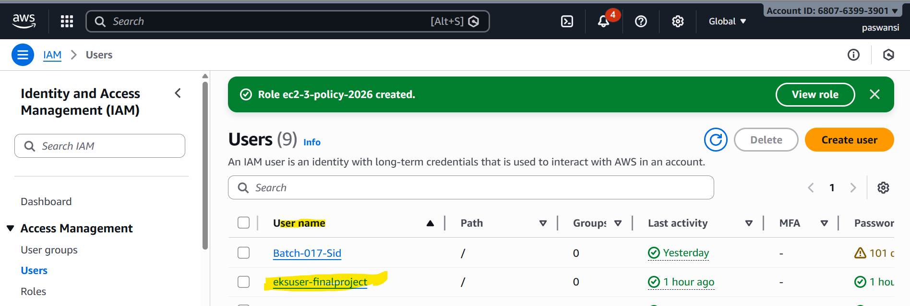
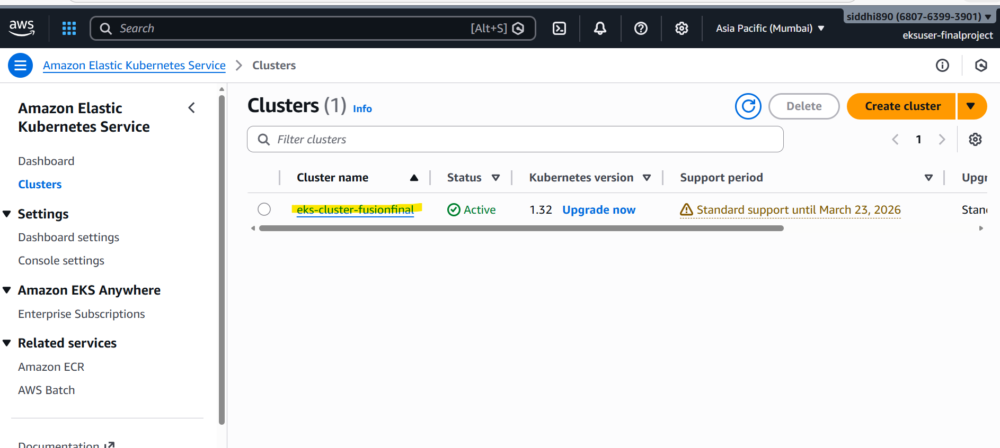
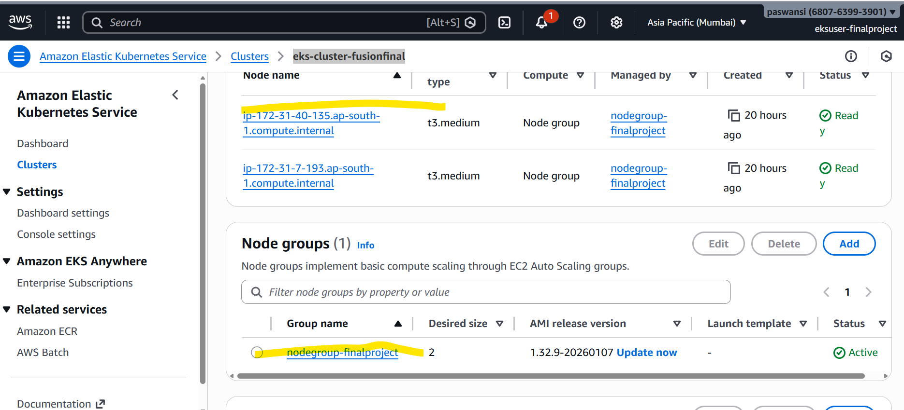

## 1. EC2 Instance

- **Created Amazon Linux EC2 instance**
  
- **Install packages using User Data**
  - Installed Java 21
  - Installed Git
  - Added Jenkins repository
  - Installed Jenkins
  - Installed Docker
  - Installed Maven
  - Started and enabled Jenkins service
  - Started and enabled Docker service
  - Added Jenkins user to Docker group


````
#!/bin/bash
sudo yum update -y
sudo yum install java-21 -y
sudo yum install git -y
sudo yum install maven -y
sudo wget -O /etc/yum.repos.d/jenkins.repo https://pkg.jenkins.io/redhat-stable/jenkins.repo
sudo yum install jenkins -y
sudo yum install docker -y
sudo systemctl start jenkins
sudo systemctl enable jenkins
sudo systemctl start docker
sudo systemctl enable docker
sudo usermod -aG docker jenkins
````


## 2.  IAM User & Role Setup

- **IAM User Setup**
  - Created one IAM user with **AdministratorAccess**
  - Logged in using this IAM user
  - Avoided using the **root user**
  - CI/CD pipeline is operated using a separate IAM account for security
  - Created **Access Key** and **Secret Access Key**
  - Used credentials for AWS CLI and automation access

- **IAM Roles Setup**
  - **EKS Cluster Role**
    - Created IAM role named **EKS-Cluster-Role**
    - Selected **EKS service**
    - Attached policy:
      - `AmazonEKSClusterPolicy`

  - **EKS Node Group Role**
    - Created IAM role for **EKS Worker Nodes**
    - Selected **EC2 service**
    - Attached policies:
      - `AmazonEKS_CNI_Policy`
      - `AmazonEC2ContainerRegistryReadOnly`
      - `AmazonEKSWorkerNodePolicy`
  
  
-    

-    

-    
  
## 3. EKS Cluster & Jump Server Setup

- **EKS Cluster Creation**
  - Created EKS cluster named **eks-cluster-fusionfinal**
  - Waited for the cluster status to become **Active**
  - Created Node Group named **nodegroup-finalproject**
  - Configured desired, minimum, and maximum number of worker nodes
  - Attached required IAM role to the node group

- **Worker Node Verification**
  - Ensured node group instances were successfully launched
  - Verified worker nodes status from the jump server using:
    - `kubectl get nodes`

- **Jump Server Setup**
  - Created a simple EC2 instance to act as a **Jump Server**
  - Installed **kubectl** on the jump server
  - Used the jump server to manage the EKS cluster

- **AWS CLI Configuration on Jump Server**
  - Configured AWS CLI using `aws configure`
  - Added **Access Key** and **Secret Access Key**
  - Set default region as **ap-south-1**

- **EKS Cluster Configuration**
  - Updated kubeconfig on the jump server using the command:
    - `aws eks update-kubeconfig --region ap-south-1 --name eks-cluster-fusionfinal`
  - Verified EKS cluster access using kubectl commands like
     kubectl get ns  (it should give responce)


1. GitHub Repository

Created GitHub repository

Added application source code

Used GitHub token for authentication

Connected Jenkins to GitHub repository

5. Jenkins Credentials

Added DockerHub credentials in Jenkins

Stored credentials securely (not in code)

Used credentials inside pipeline using withCredentials

6. Jenkins Pipeline (CI)

Checked out code from GitHub

Built application using Maven

Created Docker image

Pushed Docker image to DockerHub

7. Docker

Wrote Dockerfile

Built Docker image in Jenkins

Tagged Docker image

Pushed image to DockerHub registry

8. Amazon EKS

Created EKS cluster

Created worker nodes (EC2)

Attached IAM role to worker nodes

Configured kubectl access

9. Kubernetes Deployment (CD)

Created Kubernetes Deployment YAML

Deployed Docker image to EKS

Created Service (LoadBalancer)

Application accessed using LoadBalancer DNS

🔹 One-Line Notes (Very Short)

EC2 → Jenkins installed

Jenkins → CI pipeline created

Docker → Image build & push

EKS → Kubernetes deployment