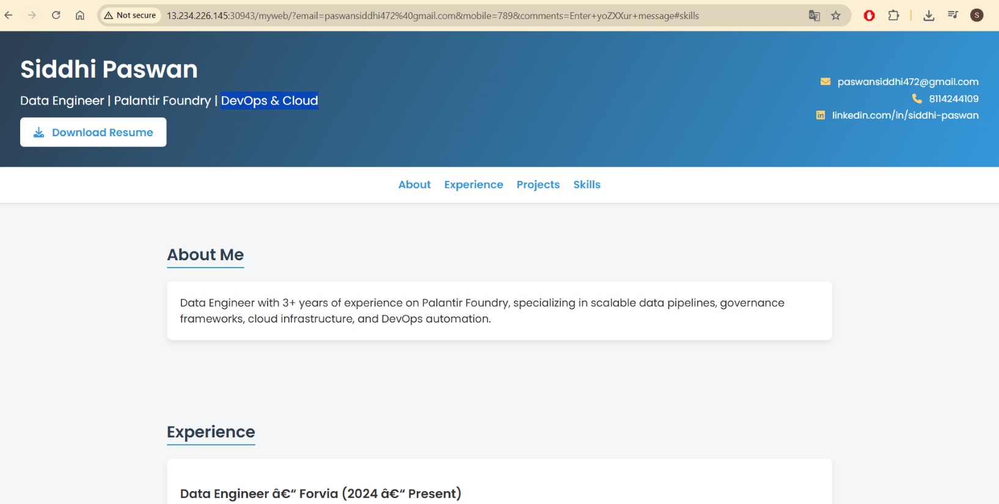
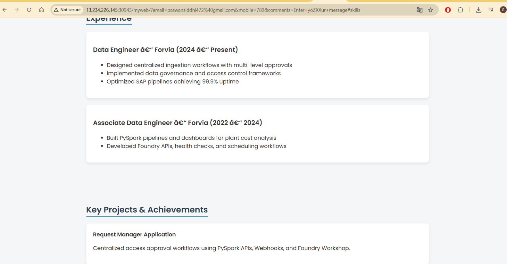
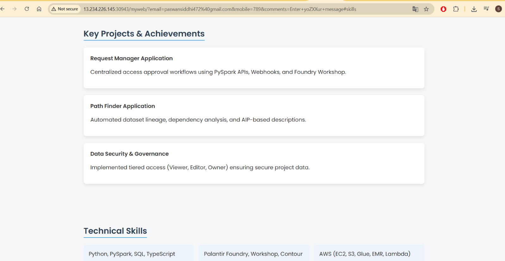
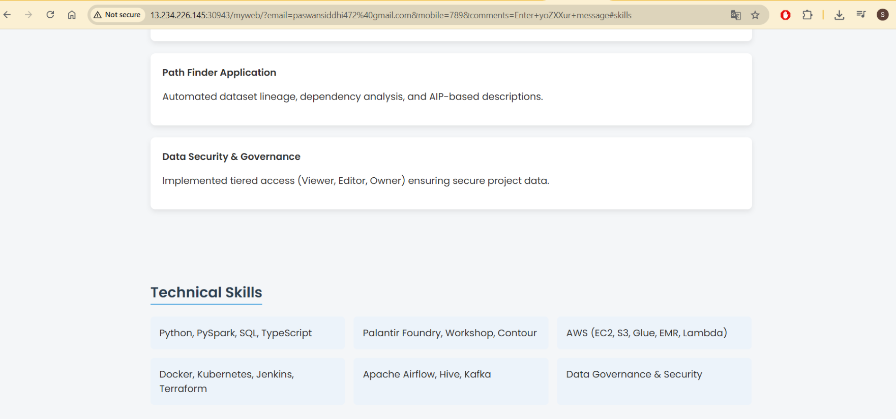

# 🚀 Final Web Application – Resume Generated via CI/CD Pipeline

## 📌 Overview

This project demonstrates the **final deployed web application** generated using a complete **CI/CD pipeline**.  
The application serves as a **professional resume website**, built and deployed automatically through DevOps best practices.

The pipeline handles:
- Code checkout from GitHub
- Build and packaging of the web application
- Deployment to the target server
- Automatic rendering of the final resume UI

The result is a **fully functional, production-style resume web application**.

---

## 🧩 Final Web Application Output

The following screenshots showcase the **final deployed resume application**, including layout, content sections, and styling.

---

### 🖥️ Application Header & Navigation

This section displays:
- Name and professional title
- Download Resume button
- Contact details
- Navigation menu
- 

---

### 👩‍💼 About & Experience Section

This section highlights:
- Professional summary
- Current and previous roles
- Key responsibilities and achievements

---

### 🏆 Projects & Achievements

This section showcases:
- Key enterprise-level projects
- Application use cases
- Governance and automation initiatives

---

### 🛠️ Technical Skills Section

This section presents:
- Programming languages
- Cloud platforms
- DevOps tools
- Data engineering technologies

---

## ⚙️ CI/CD Pipeline Contribution

The CI/CD pipeline ensures:
- Automated build and deployment
- Consistent and repeatable releases
- Faster feedback and reduced manual effort
- Reliable delivery of the final web application

Each change pushed to the repository results in an **updated resume application**, demonstrating real-world DevOps workflows.

---

## ✅ Final Outcome

- ✔ Fully automated resume deployment
- ✔ Professional UI rendered via pipeline
- ✔ GitHub-integrated CI/CD process
- ✔ Production-ready web application

This project represents a **complete DevOps lifecycle**, from source code to final deployed web application.

